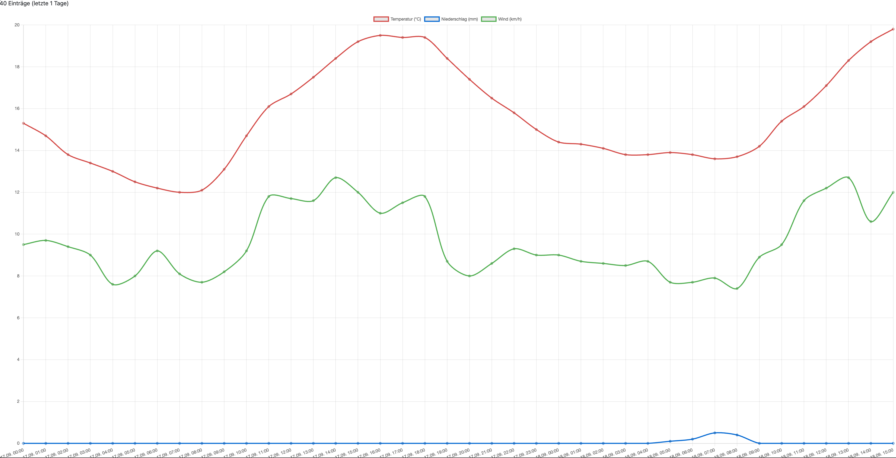

# Wetter-Dashboard

Eine Flask-Anwendung, die stündliche Wetterprognosen von der Open-Meteo-API abruft, in einer SQLite-Datenbank speichert und als Diagramme darstellt.

Persönliches Lernprojekt neben dem Studium der Wirtschaftsinformatik.



## Funktionen

- Abruf stündlicher Prognosedaten (Temperatur, Niederschlag, Windgeschwindigkeit) über die Open-Meteo-API
- Speicherung in SQLite mit Duplikatprüfung über den Zeitstempel
- Drei separate Diagramme: Temperaturverlauf, stündlicher Niederschlag, Windgeschwindigkeit
- Filter für den angezeigten Prognosezeitraum (1, 3 oder 7 Tage)
- Anzeige der aktuellen Werte für die laufende Stunde

## Technologien

| Bereich | Eingesetzt |
|---|---|
| Backend | Python, Flask |
| Datenbank | SQLite, SQLAlchemy (ORM) |
| Frontend | Jinja2, Bootstrap 5, Chart.js |
| Datenquelle | Open-Meteo API (kein API-Key erforderlich) |

## Installation

```bash
git clone https://github.com/DEIN-NAME/weather-dashboard.git
cd weather-dashboard

python3 -m venv venv
source venv/bin/activate        # Windows: venv\Scripts\activate

pip install -r requirements.txt
```

## Nutzung

Zuerst Wetterdaten abrufen und in die Datenbank schreiben:

```bash
python fetch_data.py
```

Danach die Anwendung starten:

```bash
python app.py
```

Das Dashboard ist dann unter `http://127.0.0.1:5000` erreichbar.

Beim ersten Lauf legt `fetch_data.py` die Datei `weather.db` an und speichert alle abgerufenen Stunden. Bei jedem weiteren Lauf werden nur neue Zeitstempel ergänzt, bereits vorhandene übersprungen.

## Projektstruktur

```
weather-dashboard/
├── app.py              # Flask-Routen und Aufbereitung der Daten fürs Template
├── models.py           # SQLAlchemy-Modell und Datenbankverbindung
├── fetch_data.py       # API-Abruf, Umwandlung und Speicherung
├── templates/
│   └── dashboard.html  # Jinja2-Template mit Chart.js-Einbindung
├── requirements.txt
└── README.md
```

## Ablauf der Datenverarbeitung

```
Open-Meteo API  →  parse_hourly()  →  save_records()  →  SQLite
                   (Spalten zu         (Duplikat-
                    Zeilen)             prüfung)
                                                           ↓
Browser         ←  Chart.js        ←  Flask-Route      ←  Abfrage
                   (3 Diagramme)      (Filter, Listen)
```

## Umgesetzte Entscheidungen

**Parallele Listen in Datensätze umwandeln**

Die Open-Meteo-API liefert die Daten spaltenweise: eine Liste mit allen Zeitstempeln, eine mit allen Temperaturen und so weiter. Diese Struktur spart Übertragungsvolumen, weil sich die Feldnamen nicht pro Eintrag wiederholen, lässt sich aber nicht direkt als Tabellenzeilen speichern. Die Funktion `parse_hourly()` nutzt den gemeinsamen Index der Listen und baut daraus eine Liste von Dictionaries, also einen Datensatz pro Stunde.

**SQLite statt CSV**

Da sich die Prognosezeiträume bei wiederholtem Abruf überschneiden, würden Einträge ohne Vorkehrung mehrfach gespeichert. Die Spalte `time` ist deshalb als `unique` definiert, zusätzlich prüft `save_records()` vor dem Einfügen, ob der Zeitstempel bereits vorhanden ist. Die Funktion gibt die Anzahl tatsächlich neu gespeicherter Datensätze zurück, wodurch sich ein wiederholter Lauf leicht kontrollieren lässt.

**Drei Diagramme statt einem**

Temperatur, Niederschlag und Wind liegen in völlig unterschiedlichen Größenordnungen, etwa 17 °C gegenüber 0,2 mm Niederschlag. Auf einer gemeinsamen Achse wäre der Niederschlag als flache Linie am unteren Rand nicht mehr ablesbar. Die Werte werden deshalb in drei getrennten Diagrammen dargestellt, jeweils mit eigener Skalierung. Der Niederschlag wird als Balkendiagramm gezeichnet, da es sich um Summen je Stunde handelt und nicht um einen kontinuierlichen Verlauf.

**Prognose statt Rückblick**

Der Zeitraumfilter arbeitet vorwärts, zeigt also die kommenden Tage. Grund ist die Datenlage: Die Anwendung speichert Prognosedaten, eine Historie entsteht erst durch wiederholte Aufrufe über mehrere Tage. Für einen echten Rückblick wäre die Archiv-API von Open-Meteo die passende Quelle.

**Aufbereitung im Backend**

Die Umwandlung der Datensätze in die von Chart.js erwarteten Listen geschieht in der Flask-Route, nicht im Template. Die Übergabe ans Frontend erfolgt über den Jinja2-Filter `tojson`, der gültiges JSON erzeugt und Sonderzeichen korrekt maskiert. Im Template erzeugt eine gemeinsame Hilfsfunktion alle drei Diagramme, statt den Konfigurationsblock dreimal zu wiederholen.

## Mögliche Erweiterungen

- Ortssuche über die Geocoding-API von Open-Meteo statt fester Koordinaten
- JSON-Endpunkt (`/api/weather?days=3`) für externe Nutzung
- Automatisierter täglicher Abruf, um eine Historie aufzubauen
- Vergleich von Prognose und tatsächlich eingetretenem Wetter
- Deployment, damit das Dashboard ohne lokale Installation erreichbar ist

## Datenquelle

Wetterdaten von [Open-Meteo](https://open-meteo.com), verfügbar unter CC BY 4.0.
